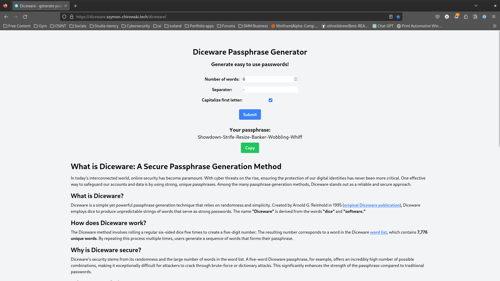
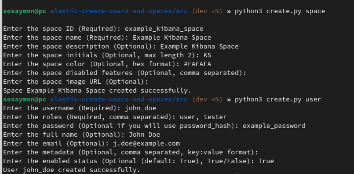
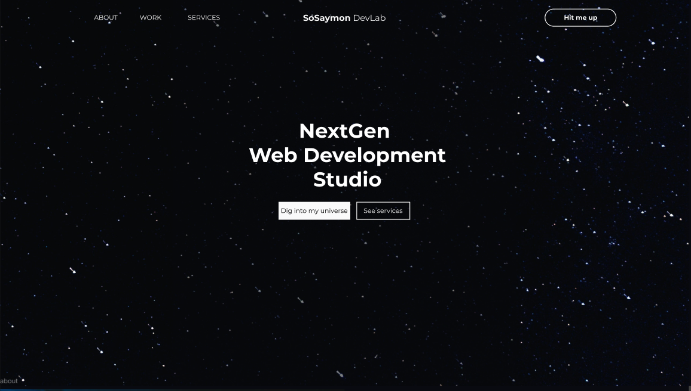
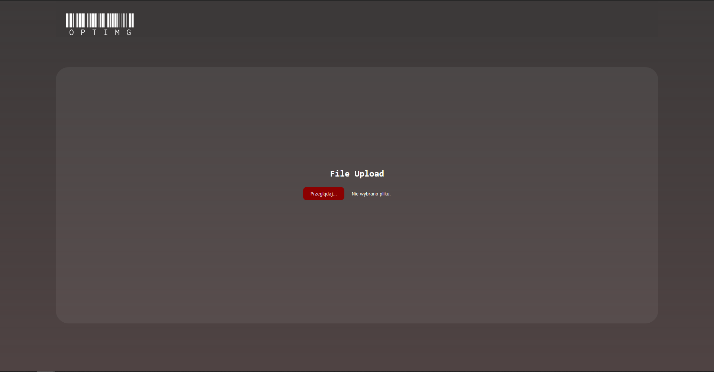
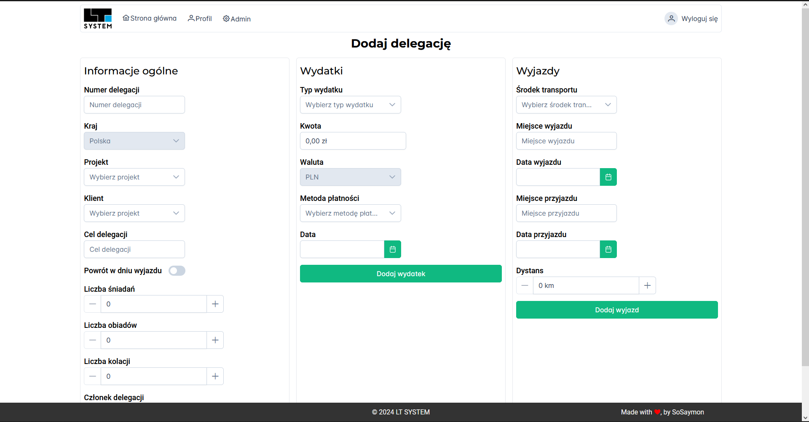

# Szymon's Portfolio

Hi there! I'm Szymon, and welcome to my portfolio. I'm a dedicated software developer with a strong passion for crafting web applications. Currently on the lookout for opportunities to kickstart my career as a junior developer, I thrive on embracing new challenges and opportunities for growth.

Here's a glimpse of what I bring to the table:

- **Fast Learner:** I adapt quickly to new technologies and environments.
- **Team Player:** Collaborative by nature, I enjoy contributing to team success and assisting colleagues.
- **Effective Communicator:** Comfortable interacting with clients and conveying complex ideas with clarity.
- **Responsible & Reliable:** Committed to delivering my best work consistently.
- **Perfectionist:** Continuously refining my skills and striving for excellence.
- **Creative Problem Solver:** I thrive on finding innovative solutions to challenges.
- **Positive & Optimistic:** With an upbeat attitude, I always look for the silver lining.
- **Hardworking & Passionate:** Driven by my love for what I do, I pursue my goals with dedication.
- **Curious & Flexible:** Eager to learn and adaptable to evolving situations.

In essence, I'm someone who's not only committed to personal and professional growth but also to making a positive impact through my work. Let's connect and explore how we can create something exceptional together!

## Projects

### Diceware Password Generator

[Demo](none) | [Code](https://github.com/SoSaymon/diceware_django)

**Status: Done**

- **Description:** A web application that generates secure passphrases using the Diceware method.
- **Tech Stack:** Django, JavaScript
- **Key Features:** 
  - User-friendly interface
  - Customizable passphrase length
  - Secure random number generation

### Easy Elastic setup

[Code](https://github.com/SoSaymon/elastic-create-users-and-spaces)

**Status: Done**

- **Description:** A script that automates the process of creating users and spaces in Elastic.
- **Tech Stack:** Python, ELK Stack
- **Key Features:** 
  - Automated user and space creation
  - Customizable user and space settings
  - Error handling

### Portfolio Website

[Demo](none)

**Status: In Progress**

- **Description:** My personal portfolio website to showcase my skills and projects.
- **Tech Stack:** Vue.js, Tailwind CSS, PrimeVue, Vite
- **Key Features:** 
  - Responsive design
  - Interactive UI
  - Project showcase

### Optimg

[Demo](http://app.airevista.studio/) | [Code](https://github.com/SoSaymon/optimg)

**Status: Done**

- **Description:** A web application that utilizes OCR to extract text from images and convert it into text. This project was build with my classmates during the final project to pass the course.
- **Tech Stack:** FastAPI, Tessaract, HTML, CSS, JavaScript
- **Key Features:** 
  - Image upload
  - Text extraction
  - Text conversion

### Business Trips Generator

 

[Demo](none)

**Status: Done**

- **Description:** A full-stack web application that generates delegation letters for employees.

- **Tech Stack:** FastAPI, Vue.js, Tailwind CSS, PrimeVue, Vite
- **Key Features:** 
  - User-friendly interface
  - Customizable delegation settings
  - PDF generation
  - Development potential

## Contact

- **Email:** [szymon.chirowski@protonmail.com](mailto:szymon.chirowski@protonmail.com)
- **LinkedIn:** [Szymon Chirowski](https://www.linkedin.com/in/szymon-chirowski/)
- **GitHub:** [SoSaymon](https://github.com/SoSaymon)
